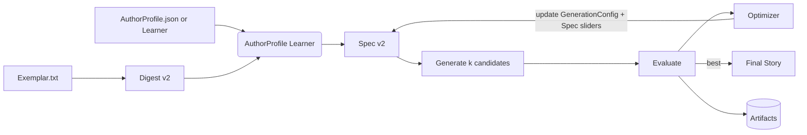

# Agentic Short Story System — v0.1

**Focus exemplar:** Denis Johnson, “Emergency.” (We use it only to reverse‑engineer structure, voice features, and storytelling moves; no verbatim reuse.)

---

## 1) Objective (what “good” looks like)
Build a reproducible, inspectable system that:
- **Learns a story’s DNA** (structural beats, voice, pacing, motifs, POV distance, sentence rhythm) from one exemplar.
- **Maps that DNA into a portable “StorySpec”** you can steer.
- **Generates new stories** in new contexts using your lexicon and preferences.
- **Audits itself** with quant+qual metrics and leaves an **observable trace** of every step.

Constraints:
- No plagiarism: guardrails against long n‑gram overlap and verbatim phrasing.
- Deterministic replay: same seed + config → same result.
- Human‑in‑the‑loop optional; core loop must converge without it.

---

## 2) Core ideas & principles
- **Separate “Form” from “Content.”** Extract reusable form (beats, transitions, rhetoric) from an exemplar, swap in new content (setting, characters, images, themes).
- **Spec → Draft → Critique → Revise** as a closed loop. Multiple candidates + selection pressure.
- **Shallow first, then deep.** Start with lightweight heuristics + LLM annotations; add complexity only if it boosts measurable quality.
- **Observability.** Every stage writes JSON artifacts; you can diff them.


### 2.1 Reconstruction vs plagiarism policy
- We **reconstruct form, not duplicate text**: the ExemplarDigest stores counts, labels, and paraphrased beat summaries; it stores **no paragraphs**.
- Generation enforces **max shared n‑gram ≤ 12** and **overlap ≤ 3%** vs the exemplar; SimHash Hamming distance ≥ 18 for any 256‑bit chunk.
- The **Reconstruction Test** targets beat functions, pacing curve, POV distance, dialogue/summary ratios, and motif placement — not wording.
- Short quotes from the exemplar are **disallowed** in generation and **omitted** from artifacts.

---

## 3) Inputs you’ll provide
- **AuthorProfile.json**: lexicon, syntax tendencies, taboo/allowed words, register sliders (deadpan ↔ lyrical, sardonic ↔ earnest), profanity policy, em‑dash usage, sentence‑length targets, dialogue ratio, etc.
- **SeedKit/** (any subset):
  - **Notes.md** (fragments, memories, conflicts, images)
  - **ScenePrompts.json** (if you have anchors you want included)
  - **Media/** (photos, clips) → optional vision analysis JSON
  - **Topic/Theme intents** (e.g., "mercy vs competence," "accidents," "ordinary divinity")
- **Exemplar.txt**: the study text (here: “Emergency”).

---

## 4) Data contracts (JSON)
Define strict, versioned schemas with `model_version` + `story_id` + `seed`.

### 4.1 StorySpec (full form, v2)
```json
{
  "schema": "StorySpec@2",
  "meta": {
    "story_id": "...",
    "seed": 137,
    "version": "2.0",
    "derived_from": {"exemplar": "Emergency", "digest_version": 2}
  },
  "voice": {
    "person": "first|second|third-limited|omniscient",
    "tense_strategy": {"primary": "past", "allows_flashback": true, "flashback_marker_style": "line-break+temporal cue"},
    "distance": "intimate|close|medium|distant",
    "register": {"lyric": 0.3, "deadpan": 0.7, "irony": 0.5, "tender": 0.6, "clinical": 0.2},
    "syntax": {
      "avg_sentence_len": 15,
      "variance": 0.6,
      "fragment_ok": true,
      "parataxis_vs_hypotaxis": 0.7,
      "comma_density": 0.55,
      "em_dash": "rare|moderate|frequent",
      "semicolon_ok": false
    },
    "diction": {
      "concrete": 0.7,
      "abstract": 0.3,
      "slang": 0.2,
      "medical": 0.4,
      "latinate": 0.2,
      "anglo": 0.8
    },
    "dialogue_style": {
      "quote_marks": "double",
      "tag_verbs_allowed": ["said", "asked"],
      "ban_adverbs_after_tags": true,
      "beats_per_dialogue": {"min": 0, "max": 2}
    },
    "profanity": {"allowed": false, "frequency": 0.0}
  },
  "form": {
    "structure": "episodic|classic|frame|modular",
    "beat_map": [
      {"id": "cold_open", "target_words": 180, "function": "tonal hook", "cadence": "short"},
      {"id": "inciting_turn", "target_words": 250, "function": "moral/physical jolt", "cadence": "mixed"},
      {"id": "setpiece_1", "target_words": 400, "function": "scene", "cadence": "long"},
      {"id": "setpiece_2", "target_words": 400, "function": "scene", "cadence": "long"},
      {"id": "numinous_glimpse", "target_words": 180, "function": "strangeness/meaning", "cadence": "short"},
      {"id": "coda_deflation", "target_words": 120, "function": "echo/return", "cadence": "short"}
    ],
    "scene_ratio": {"scene": 0.7, "summary": 0.3},
    "dialogue_ratio": 0.25,
    "time_weave": {"chronology": "loose", "analepsis_budget": 2, "prolepsis_budget": 0},
    "viewpoint": {"fixed": true, "allowed_shifts": []},
    "paragraphing": {"avg_len_tokens": 45, "variance": 0.4},
    "transitions": ["jump-cut", "hard line break", "quiet deflation"]
  },
  "content": {
    "setting": {"place": "...", "time": "seasonal marker", "weather_budget": ["fog", "wet roads"]},
    "characters": [
      {"name": "protagonist", "role": "narrator", "goal": "...", "wound": "...", "quirks": ["..."], "diction_quirks": ["..."]},
      {"name": "foil", "role": "catalyst", "goal": "...", "wound": "..."}
    ],
    "motifs": ["injury/care", "accidentality", "small miracles"],
    "imagery_palette": ["fluorescent hospital", "flat highways", "weather flip"],
    "symbol_budget": {"max_new_symbols": 2},
    "props": ["..."],
    "sensory_quotas": {"visual": 0.4, "auditory": 0.2, "tactile": 0.2, "olfactory": 0.1, "gustatory": 0.1}
  },
  "constraints": {
    "anti_plagiarism": {"max_ngram": 12, "overlap_pct": 0.03, "simhash_hamming_min": 18},
    "length_words": {"min": 1200, "target": 2000, "max": 2800},
    "forbidden": ["overwrought metaphors", "unearned epiphany"],
    "must_include": ["quiet physical task", "moral ambiguity"],
    "safety_lexicon": {"taboo": [], "ban_lists": []},
    "external_knowledge": {"allowed": false},
    "image_grounding": {"use": false}
  }
}
```

### 4.2 ExemplarDigest (expanded, v2)
```json
{
  "schema": "ExemplarDigest@2",
  "meta": {"source": "Emergency", "tokens": 0, "paragraphs": 0},
  "stylometry": {
    "sentence_len_hist": [],
    "type_token_ratio": 0.0,
    "mtld": 0.0,
    "function_word_profile": {"and": 0.0, "but": 0.0, "the": 0.0},
    "pos_trigrams_top": [],
    "dep_arcs": {"parataxis": 0.0, "advcl": 0.0, "ccomp": 0.0},
    "punctuation": {"comma_per_100": 0.0, "dash_per_100": 0.0, "semicolon_per_100": 0.0},
    "figurative_density": {"simile": 0.0, "metaphor": 0.0, "personification": 0.0},
    "rhetorical_questions": 0
  },
  "discourse": {
    "beats": [
      {"id": "cold_open", "span": [0,180], "function": "tonal hook"},
      {"id": "inciting_turn", "span": [181,430], "function": "jolt"}
    ],
    "scene_summary_switches": [],
    "dialogue_ratio": 0.0,
    "tense_distribution": {"past": 0.9, "present": 0.1},
    "focalization": "internal",
    "free_indirect_markers": 0.3,
    "deictics": {"now": 0.0, "here": 0.0},
    "anaphora_stats": {"avg_chain_len": 0.0, "max_chain": 0}
  },
  "pacing": {
    "pacing_curve": [],
    "pause_density": 0.0,
    "paragraph_len_hist": [],
    "whitespace_ratio": 0.0
  },
  "coherence_graph": {"entities": [], "edges": []},
  "motif_map": [
    {"motif": "accident", "anchors": [], "co_occurs_with": ["mercy"]}
  ],
  "imagery_palettes": {"hospital": [], "road": []},
  "event_scripts": [
    {"script": "ER intake", "triples": [["nurse","asks","questions"]]}
  ],
  "lexical_domains": {"medical": [], "working_class": []},
  "valence_arc": {"per_beat": [], "overall_delta": 0.0},
  "surprise_curve": [],
  "safety": {"profanity_rate": 0.0, "taboo_topics": []}
}
```

### 4.3 GenerationConfig (orchestrator knobs, v2)
```json
{
  "schema": "GenerationConfig@2",
  "seed": 137,
  "num_candidates": 8,
  "per_beat_generation": {
    "temperature": [0.7, 0.95],
    "top_p": [0.85, 0.95],
    "length_tolerance": 0.2,
    "repetition_penalty": 1.05,
    "stop_on": ["

"],
    "rewrite_passes": 1
  },
  "diversity": {"beat_shuffle": 0.15, "spec_jitter": 0.1},
  "constraint_enforcement": {
    "max_ngram": 12,
    "simhash_hamming_min": 18,
    "forbidden_lexicon": []
  },
  "repair_steps": {"enable_line_edit": true, "max_passes": 2},
  "evaluator_suite": ["stylefit", "formfit", "coherence", "freshness", "overlap_guard", "valence_arc_fit", "cadence"],
  "objective_weights": {"stylefit": 0.3, "formfit": 0.3, "coherence": 0.25, "freshness": 0.1, "cadence": 0.05},
  "optimizer": {
    "mode": "adamish",
    "max_iters": 10,
    "warmup_iters": 2,
    "patience": 3,
    "step_size": 0.1,
    "beta1": 0.8,
    "beta2": 0.95,
    "exploration_radius": 0.08,
    "population": 6
  },
  "caching": {"prompt_cache": true, "digest_cache": true}
}
```

### 4.4 EvalReport (scores & diagnostics, v2)
```json
{
  "schema": "EvalReport@2",
  "run_id": "...",
  "candidate_id": "...",
  "config_hash": "...",
  "seeds": {"global": 137, "per_beat": [137,138,139]},
  "length": {"words": 0, "paragraphs": 0},
  "scores": {
    "overall": 0.0,
    "stylefit": 0.78,
    "formfit": 0.74,
    "coherence": 0.81,
    "freshness": 0.69,
    "overlap_guard": {"max_ngram": 9, "overlap_pct": 0.012},
    "valence_arc_fit": 0.7,
    "cadence": 0.66,
    "dialogue_balance": 0.8,
    "motif_coverage": 0.75
  },
  "per_beat": [
    {"id": "cold_open", "stylefit": 0.8, "formfit": 0.7, "notes": "good tonal hook"}
  ],
  "coherence_graph": {"entities": [], "edges": []},
  "red_flags": ["POV drift in beat 3"],
  "guardrail_failures": [],
  "drift_vs_spec": [
    {"field": "dialogue_ratio", "target": 0.25, "actual": 0.33, "delta": 0.08}
  ],
  "tuning_suggestions": [
    {"param": "per_beat_generation.temperature", "action": "decrease", "by": 0.05, "reason": "excessive variance in beat 2"}
  ],
  "pass_fail": true,
  "notes": "Ending lands; middle sags; trim beat 2 by ~80 words.",
  "repro": {"git_commit": "...", "model": "GPT-5-Thought", "model_temp": 0.85}
}
```

---

$1

### D) Optimizer loop ("Adam-ish" schedule)


$2

## 6) Evaluations (objective + subjective)
**Automated:**
- **StyleFit:** stylometry vs AuthorProfile + ExemplarDigest (sentence length distribution, POS n‑grams, function‑word profiles, hedging, modality; cosine to target vector).
- **FormFit:** beat coverage, scene/summary ratio, dialogue ratio, transition types.
- **Coherence:** entity tracking (character, time, setting), pronoun chains, contradiction flags.
- **Freshness:** novelty vs exemplar & corpus (SimHash/HNSW + semantic sim caps).
- **OverlapGuard:** longest shared n‑gram, overall overlap %, Levenshtein bursts.

**Subjective rubrics (LLM‑assisted, you review):**
- Does the ending **re‑color** earlier beats without preaching?
- Are “numinous” moments earned (strange/holy glimpses grounded in concrete detail)?
- Prose texture: concreteness, sensory spread, verb energy.

All evaluators emit JSON + short rationales; failing checks route back to Spec adjustments.

---

## 7) Roadmap (thin slices)
1) **Repo + Contracts**
   - Create `AuthorProfile.json` for *your* voice preferences (registers, swearing policy, em‑dash rules, etc.).
   - Define `StorySpec@1`, `ExemplarDigest@1`, `GenerationConfig@1`, `EvalReport@1` as Pydantic models.

2) **ExemplarDigest (Emergency)**
   - Heuristics: sentence length histogram, POS n‑grams, dialogue detection, scene/summary toggles by cue words, transition catalog.
   - LLM pass: label beats, ethos keywords, motif anchors, POV distance notes.
   - Emit `ExemplarDigest.json` + quick plots.

3) **Spec Synthesizer**
   - Map Digest → initial StorySpec with tunable sliders.
   - Allow manual edits to content section (new setting, characters, motifs).

4) **Draft Generator**
   - Structured prompting **per beat** with constraints from StorySpec.
   - Candidate ensemble (k=6) with small temperature sweeps + beat shuffles.

5) **Evaluator Suite**
   - Implement metrics above; produce `EvalReport.json` per candidate.
   - Selection policy: weighted sum + hard guardrails.

6) **Reconstruction Test (v0)**
   - Run Reconstruction loop (Workflow C) to calibrate Spec from “Emergency”.
   - Target: pass all guards while **not** approximating verbatim phrasing.

7) **Your‑Voice Calibration**
   - Feed `AuthorProfile.json` from your own texts (emails, notes, essays) ⇒ update diction/syntax sliders.

8) **First Original Story**
   - Swap in new content (themes/settings), generate, evaluate, iterate.

9) **Generalize**
   - Add more exemplars; cluster Digest vectors to learn reusable “forms.”

---

$1

Add:
- `profiles/learn_author_profile.py` → blends ExemplarDigest with your corpus (`alpha_exemplar` vs `alpha_author`), respecting Clean Mode.
- `orchestrators/optimizer.py` → manages the Adam‑ish schedule with patience + exploration.

$2

## 9) Guardrails & risks
- **Plagiarism:** enforce n‑gram/SimHash limits; require motif/beat re‑instantiation with new imagery.
- **Mode collapse:** diversity controls per beat + minimum lexical novelty.
- **POV drift:** coherence checker rejects shifts unless Spec allows.
- **Over‑sanitization:** profanity/rough diction sliders in `AuthorProfile.json` keep authenticity.
- **Over‑lyricism:** cap figurative density; prefer concrete sensory verbs.


### Content-safety modes (toggle now, add later)
- **Clean Mode (default):** `profanity.allowed=false`, `frequency=0.0`; lexicon filter removes taboo lists; evaluator rejects flagged terms; choose mainstream safety models.
- **Grit Mode (future):** `profanity.allowed=true` with frequency cap; swap to models with permissive content policies; keep guardrails and n‑gram/SimHash checks.

---

## 10) Example stubs

### 10.1 Minimal AuthorProfile.json (start here)
```json
{
  "schema": "AuthorProfile@1",
  "lexicon": {"prefer": ["plain nouns", "everyday verbs"], "avoid": ["generally"]},
  "syntax": {"avg_sentence_len": 14, "variance": 0.55, "em_dash": "rare"},
  "register": {"deadpan": 0.7, "tender": 0.6, "irony": 0.4},
  "profanity": {"allowed": false, "frequency": 0.0}
}
```json
{
  "schema": "AuthorProfile@1",
  "lexicon": {"prefer": ["plain nouns", "everyday verbs"], "avoid": ["generally"]},
  "syntax": {"avg_sentence_len": 14, "variance": 0.55, "em_dash": "rare"},
  "register": {"deadpan": 0.7, "tender": 0.6, "irony": 0.4},
  "profanity": {"allowed": false, "frequency": 0.0}
}
```

### 10.2 Prompt frame (per beat)
```text
You are the Drafter. Using StorySpec and Beat {id}, write ~{target_words} words in {voice.person} with {voice.distance} distance.
Honor dialogue_ratio and scene/summary ratio. Keep diction {diction} and syntax constraints.
Avoid any phrasing longer than 12 tokens that appears in the Exemplar.
End with a soft deflation that tees up the next beat: {next_hint}.
```

### 10.3 Selection policy (pseudo)
```
score = 0.35*stylefit + 0.35*formfit + 0.25*coherence + 0.05*freshness
if overlap_guard.fail: reject
pick top-2; send weakest beat back for rewrite with targeted deltas
```

---

$1

12) **Optimization loop plan**
   - Start with **5 iterations** (warmup 2, then 3 with optimizer active). If `overall` improves <0.5% across 2 iters, stop (patience). If plateau, expand to **10 iterations** and widen `exploration_radius` to 0.12.
   - Treat the score as multi‑objective; follow `objective_weights` in GenerationConfig v2.
   - Persist every `Spec.json`, `Config.json`, `EvalReport.json`; the Optimizer writes a `diff` per iteration for audit.

