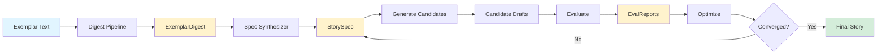
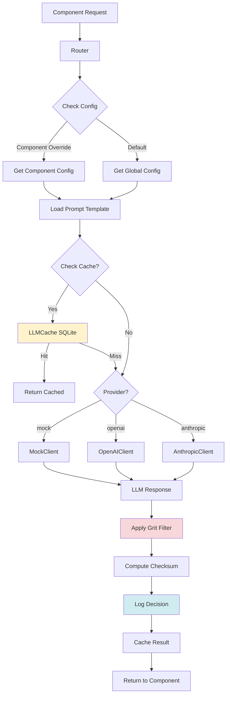
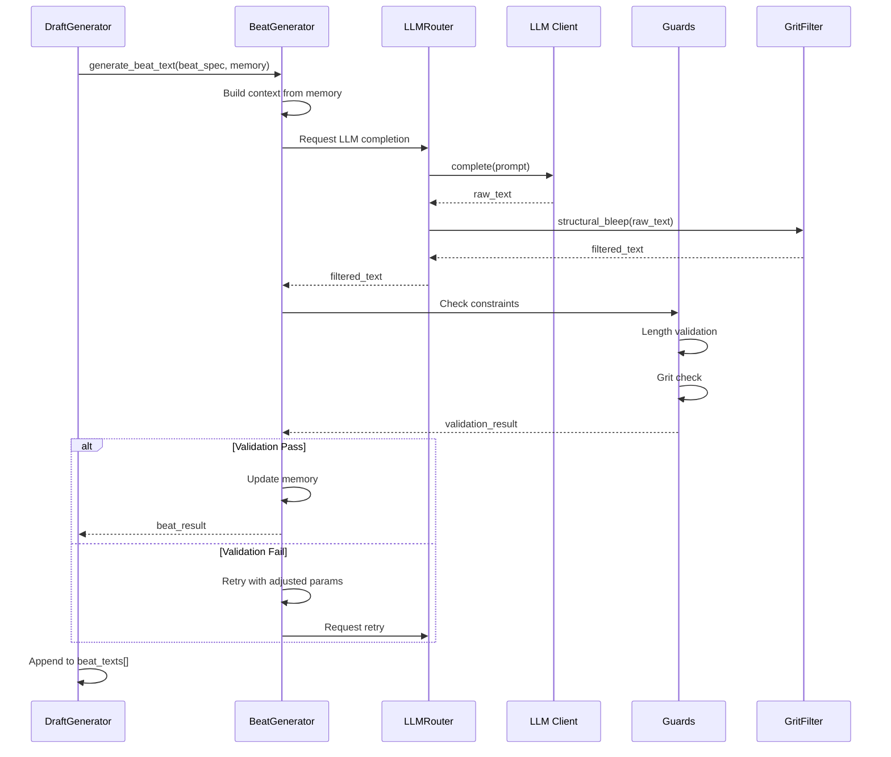
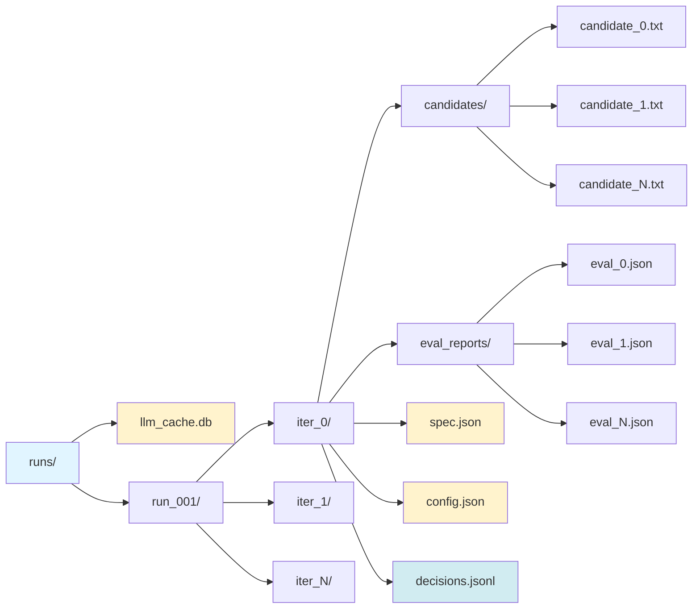
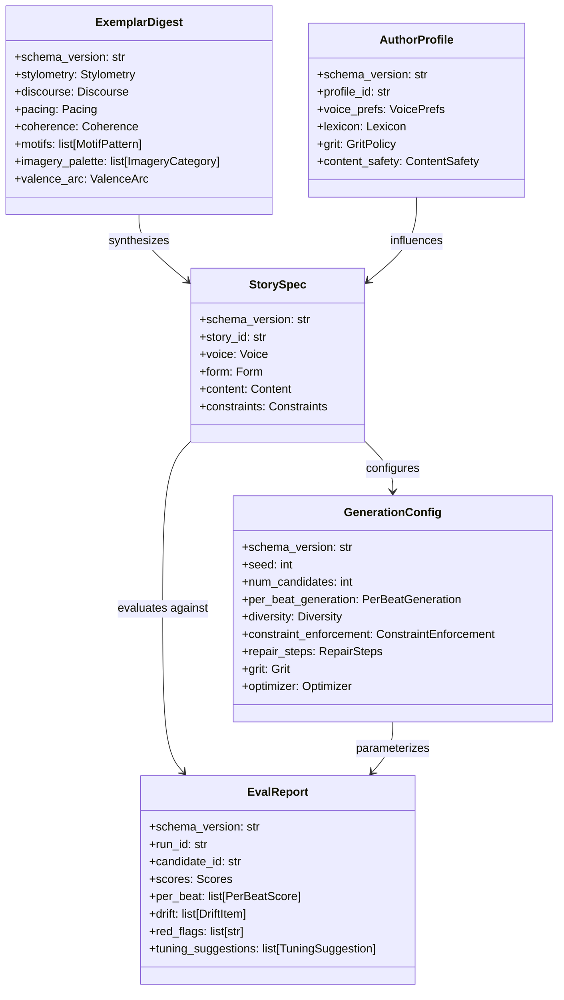

# Architecture Documentation

This document provides detailed architecture diagrams for the Literary Structure Generator system. Each diagram is followed by a brief explanation of the components and their relationships.

---

## 1. High-Level Pipeline

The complete end-to-end pipeline from exemplar to optimized story:



**Explanation:**
The pipeline begins with an exemplar text that is analyzed by the digest pipeline to extract its structural DNA (stylometry, discourse patterns, pacing, motifs). This produces an `ExemplarDigest`. The spec synthesizer then creates a portable `StorySpec` that maps voice, form, and content parameters. Multiple candidate drafts are generated from the spec, evaluated using a comprehensive suite of metrics, and iteratively optimized until convergence. The system supports reproducibility through seeded randomness and JSON-serializable artifacts at each stage.

---

## 2. LLM Routing, Caching & Prompt Flow

How LLM calls are routed, cached, and executed with drift control:



**Explanation:**
The LLM router centralizes all LLM interactions. When a component (e.g., `motif_labeler`, `beat_paraphraser`) requests LLM completion, the router checks for component-specific or global configuration. It loads the versioned prompt template from the `prompts/` directory, optionally checks the SQLite cache (keyed by prompt + params), and dispatches to the appropriate client (Mock, OpenAI, or Anthropic). Responses pass through the universal grit filter, are checksummed for drift detection, logged for reproducibility, cached for efficiency, and returned to the caller.

---

## 3. Per-Beat Generation Sequence

Detailed sequence of generating a single beat with memory and validation:



**Explanation:**
Beat generation is context-aware and iterative. The `DraftGenerator` orchestrates per-beat generation, passing accumulated memory (previous beats' text and functions) to the `BeatGenerator`. The generator constructs a prompt enriched with context, requests completion via the router, and receives grit-filtered text. Guards validate length and content constraints. If validation fails, the generator retries with adjusted parameters (e.g., reduced temperature, stricter length hints). Successfully validated beats update the memory context for subsequent beats.

---

## 4. Evaluation Suite Composition

How multiple evaluators contribute to a comprehensive `EvalReport`:

```mermaid
flowchart TB
    A[Generated Text] --> B[Evaluation Orchestrator]
    B --> C[StyleFit Rules]
    B --> D[StyleFit LLM]
    B --> E[FormFit]
    B --> F[CoherenceGraphFit]
    B --> G[MotifImageryCoverage]
    B --> H[OverlapGuard]
    B --> I[CadencePacing]
    B --> J[ValenceArcFit]
    
    C --> K[Component Scores]
    D --> K
    E --> K
    F --> K
    G --> K
    H --> K
    I --> K
    J --> K
    
    K --> L[Weighted Aggregation]
    L --> M[Overall Score]
    
    K --> N[Drift Detection]
    N --> O[Identify Deviations]
    
    K --> P[Red Flag Detection]
    P --> Q[Constraint Violations]
    
    M --> R[EvalReport@2]
    O --> R
    Q --> R
    R --> S[Tuning Suggestions]
    
    style R fill:#d4edda
    style S fill:#fff3cd
```

**Explanation:**
The evaluation orchestrator runs a comprehensive suite of 8+ evaluators in parallel. **StyleFit** evaluators check voice conformance (POV, tense, syntax patterns) using both heuristic rules and optional LLM scoring. **FormFit** validates structural adherence (beat lengths, dialogue ratio, scene/summary balance). **CoherenceGraphFit** ensures entity consistency and narrative coherence. **MotifImageryCoverage** verifies thematic alignment. **OverlapGuard** enforces anti-plagiarism constraints (n-gram overlap, SimHash distance). **CadencePacing** checks rhythm and paragraph variance. **ValenceArcFit** validates emotional trajectory. Component scores are aggregated with configurable weights to produce an overall score. The report also includes drift items (deviations from spec), red flags (hard constraint violations), and tuning suggestions for the optimizer.

---

## 5. Runs & Artifacts Layout

File system organization of runs, iterations, and artifacts:



**Explanation:**
The `runs/` directory contains all execution artifacts. `llm_cache.db` is a shared SQLite cache for LLM responses, keyed by (component, model, prompt_version, params, prompt_text). Each run gets a timestamped directory (e.g., `run_001/`), which contains subdirectories for each optimization iteration. Within each iteration: `candidates/` stores generated draft texts, `eval_reports/` stores JSON evaluation results, `spec.json` captures the current `StorySpec`, `config.json` stores the `GenerationConfig`, and `decisions.jsonl` logs every decision made by agents (LLM calls, optimizer adjustments, etc.) in append-only JSONL format for full reproducibility and auditing.

---

## 6. Data Model Relationships

Core Pydantic models and their relationships:



**Explanation:**
The system uses five core Pydantic models as JSON-serializable data artifacts:

1. **ExemplarDigest** captures the structural DNA extracted from an exemplar text (voice patterns, discourse structure, pacing rhythms, coherence graphs, motifs, imagery, emotional arc).

2. **StorySpec** is synthesized from the digest and represents a portable specification for generation. It defines voice parameters (POV, tense, syntax), form (beat structure, dialogue ratio), content (setting, characters, themes), and anti-plagiarism constraints.

3. **GenerationConfig** controls the orchestrator's behavior: LLM sampling parameters, diversity controls, constraint enforcement, repair settings, grit filtering, evaluator suite composition, and optimizer hyperparameters.

4. **EvalReport** contains comprehensive evaluation results: component scores, per-beat analysis, drift detection (deviations from spec), red flags (constraint violations), and tuning suggestions for iterative improvement.

5. **AuthorProfile** captures user voice preferences and can be learned from a corpus or manually configured. It influences spec synthesis by blending with exemplar patterns.

All models are versioned (e.g., `@2`) for schema evolution and use Pydantic for validation, type safety, and JSON serialization.

---

## Key Design Principles

1. **Reproducibility**: Seeded randomness, versioned prompts, decision logging, and JSON artifacts enable exact reproduction of any run.

2. **Modularity**: Each component (digest, spec, generation, evaluation, optimization) is independently testable and swappable.

3. **Transparency**: All LLM calls, decisions, and intermediate artifacts are logged and inspectable.

4. **Anti-Plagiarism**: Multi-layered guards (n-gram overlap, SimHash distance, entity blocking) prevent verbatim copying.

5. **Drift Control**: Prompt versioning, semantic checksums, and low-temperature sampling prevent model drift.

6. **Grit Handling**: Universal `[bleep]` filtering maintains narrative authenticity while ensuring content safety.

7. **Iterative Refinement**: Evaluation-driven optimization loop continuously improves quality through targeted adjustments.
